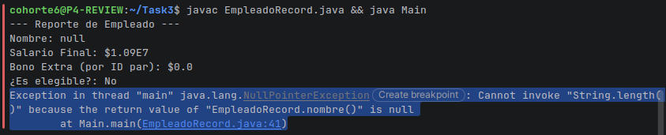

****Helpful NullPointerExceptions****

A diferencia de Java 8, que solo indicaba la línea del error, Java 21 identifica qué método falló (length()) y por qué variable o método se originó el nulo (nombre()), lo que reduce drásticamente el tiempo de depuración."

***Comparacion de igualdad (==) de 2 objetos y su resultados***

/*== VS EQUALS:

        VERSION 8
                == solo compara en el stack (tipo primitivo) y si las variables son distintas pero tienen el mismo valor es true
        EQUALS no existe en esta version de java.

        VERSIONES DONDE EXISTA EL RECORD
        si hacemos == a dos variables distintas de dos instancias sera false aunque tengan el mismo contenido porque son dos objetos diferentes viviendo en 2 espacios de memoria diferentes; la unica forma de que sea true es que las dos variables apunten a la misma direccion de memoria es decir mismo objeto
        si hacemos un EQUALS a esas misma instancias sera true porque esta comparando lo que hay dentro de cada objeto a pesar de que vivan en espacios de memoria diferente.*/

